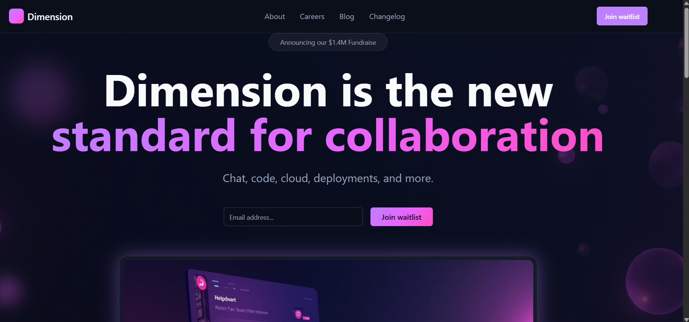
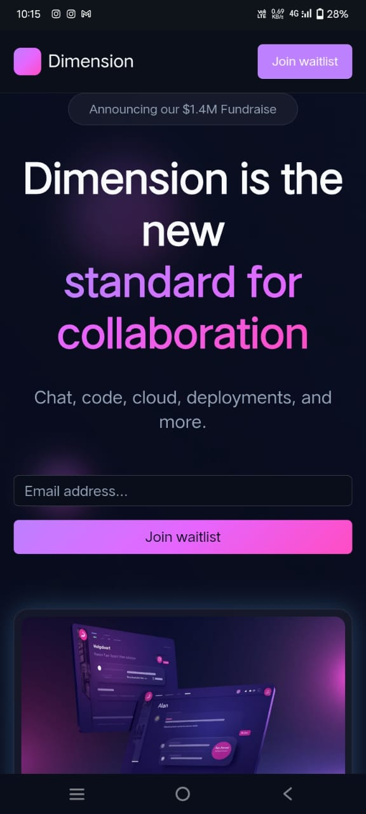

# Dimension Landing Page 

This project is a **responsive landing page** built using **Next.js**, **TypeScript**, and **Tailwind CSS**, inspired by the design and animations on [dimension.dev](https://www.dimension.dev/).  

 **Purpose:**  
This project is developed as part of an **internship assignment** to demonstrate proficiency in modern frontend development tools and frameworks, responsive design principles, and UI/UX implementation.  

---

##  Project Objective
- To replicate the **landing page UI** and **animations** of the given reference website.
- To showcase the ability to use **Next.js with TypeScript** for scalable and maintainable code.
- To implement **responsive design** for all screen sizes using Tailwind CSS.
- To create a **clean and professional codebase** for production readiness.

---

##  Features
-  Built using **Next.js (App Router)** with **TypeScript**.
-  **Tailwind CSS** for utility-first styling and responsiveness.
-  Smooth **animations and transitions** inspired by the reference site.
-  Fully **responsive** for mobile, tablet, and desktop screens.
-  SEO-friendly with proper **meta tags**.
-  Clean, maintainable code adhering to best practices.

---

##  Tech Stack
- **Frontend Framework:** Next.js  
- **Language:** TypeScript  
- **Styling:** Tailwind CSS  
- **Animations:** Framer Motion  
- **Deployment:** Vercel  

---
##  Screenshots
### Desktop View

---
### Mobile View

---

##  Installation & Setup
Clone the repository and install dependencies:

```bash
# Clone the repository
https://github.com/SushAN766/animated-dimension-ui.git

# Navigate to the project folder
cd animated-dimension-ui

# Install dependencies
npm install

```
##  Run the Development Server
Start the local development server:

```bash
npm run dev
```
The app will run at **[http://localhost:8080](http://localhost:8080)**.

---


##  Responsiveness
This project is designed to work across:

-  Mobile devices
-  Tablets
-  Desktop screens

---

##  Deployment
To deploy the project on **Vercel**:

```bash
npm run build
```

Then, push the code to GitHub and connect the repository to **[Vercel](https://vercel.com/)**.


---

##  Purpose of This Project
This landing page clone is built exclusively for the **Internship Assignment**   
It demonstrates:

- Ability to replicate complex UI and animations.
- Proficiency in **Next.js**, **TypeScript**, and **Tailwind CSS**.
- Knowledge of **responsive design principles**.
- Clean, maintainable, and production-ready code.
